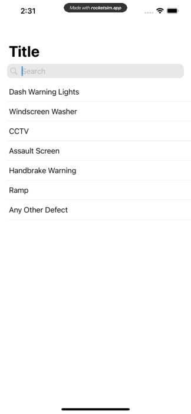
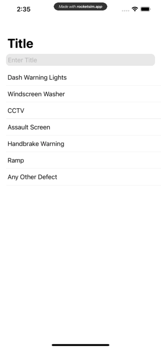

# AFFilterList

#### A Filtering List for SwiftUI

- [ ] Would like text be hidden then show when screen pulled down slight as in the Setting menu on iPhone

## Installation

Add this Swift package in Xcode using its Github repository url. (File > Swift Packages > Add Package Dependency...)

## Usage

You need a collection of `Identifiable` data for computing the list. The `filterKeys` need to `String` but you can choose which field(s) you want to filter on.

The default placeholder is "Search" however you can change that in call.

The default SF Symbol is "magnifyingglass" however you can put any SF Symbol 

If you want text only to show then make `systemImage: nil`

## Example 

Here is a simple example code:

```swift
import AFFilterList
import SwiftUI

struct ContentView: View {
    let data = Bundle.main.decode([Cab].self, from: "Cab.json")

    var body: some View {
        NavigationView {
            FilterList(data, filterKeys: \.title) {
                Text($0.title)
            }
            .navigationTitle("Title")
        }
        .listStyle(PlainListStyle())
    }
}
```



Change the PlaceHolder

```swift
import AFFilterList
import SwiftUI

struct ContentView: View {
    let data = Bundle.main.decode([Cab].self, from: "Cab.json")

    var body: some View {
        NavigationView {
            FilterList(data, filterKeys: \.title, placeholder: "Enter Title",systemImage: nil) {
                Text($0.title)
            }
            .navigationTitle("Title")
        }
        .listStyle(PlainListStyle())
    }
}
```



## Credit

This was base on [Paul Hudson](https://twitter.com/twostraws) who writes [Hacking with Swift](https://www.hackingwithswift.com). It’s available under the MIT license, which permits commercial use, modification, distribution, and private use.

I was able to do this Package with the great Video of [Creating a Swift Package in Xcode](https://youtu.be/o0fQC7JU-Ts) from [Stewart Lynch](https://twitter.com/@StewartLynch) from [CreaTech Solutions](https://www.createchsol.com).

## License

This package is released under the MIT License, which is copied below.

Copyright (c) 2021 Nigel Gee

Permission is hereby granted, free of charge, to any person obtaining a copy of this software and associated documentation files (the "Software"), to deal in the Software without restriction, including without limitation the rights to use, copy, modify, merge, publish, distribute, sublicense, and/or sell copies of the Software, and to permit persons to whom the Software is furnished to do so, subject to the following conditions:

The above copyright notice and this permission notice shall be included in all copies or substantial portions of the Software.

THE SOFTWARE IS PROVIDED "AS IS", WITHOUT WARRANTY OF ANY KIND, EXPRESS OR IMPLIED, INCLUDING BUT NOT LIMITED TO THE WARRANTIES OF MERCHANTABILITY, FITNESS FOR A PARTICULAR PURPOSE AND NONINFRINGEMENT. IN NO EVENT SHALL THE AUTHORS OR COPYRIGHT HOLDERS BE LIABLE FOR ANY CLAIM, DAMAGES OR OTHER LIABILITY, WHETHER IN AN ACTION OF CONTRACT, TORT OR OTHERWISE, ARISING FROM, OUT OF OR IN CONNECTION WITH THE SOFTWARE OR THE USE OR OTHER DEALINGS IN THE SOFTWARE.

